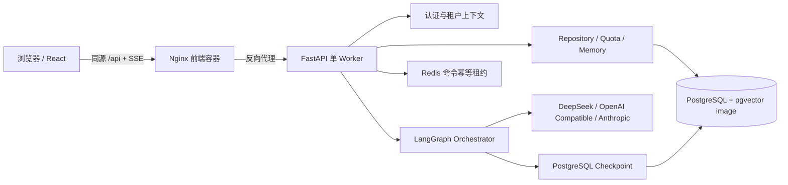
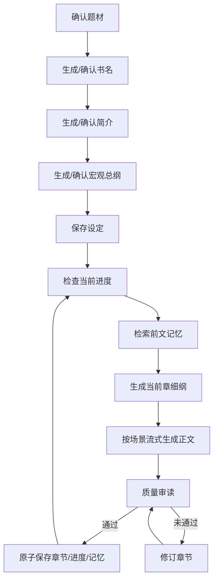

# 墨间 Novel Writer

墨间是一个面向长篇中文小说创作的多租户 AI 写作平台。系统以“编辑部”为租户边界，将书架、创建向导、章节编辑、实时生成、质量审读、连续性记忆、成员协作和平台管理集中在同一个工作台中。

后端使用 FastAPI、LangGraph 和 PostgreSQL，前端使用 React、TypeScript 和 Vite。小说生成不是单次 Prompt，而是一条可中断、可恢复、可审读、可修订的状态工作流。

## 功能概览

- 邮箱密码注册、登录、Refresh Token 轮换和退出登录。
- 一个账号可加入多个租户，并在前端切换当前编辑部。
- `owner`、`admin`、`member` 三级租户角色。
- 书架、新建作品向导和桌面三栏/移动端标签式创作工作台。
- DeepSeek、OpenAI 兼容接口和 Anthropic 三种 LLM Provider。
- 题材、书名、简介、宏观总纲、逐章细纲、正文、审读、修订和持久化工作流。
- 正文通过 SSE 逐片输出，稿纸区域实时渲染 Markdown。
- 自动模式和手动审阅模式。
- 章节连续性状态、近期章节、历史摘要和静态故事圣经。
- PostgreSQL 持久化章节、进度、记忆、LangGraph checkpoint 和额度流水。
- 每租户自然月 AI 额度，使用运行 ID 和操作唯一键保证幂等。
- 工作流取消、断线状态同步、失败节点 retry 和 checkpoint 恢复。
- 平台管理员租户/账号管理。
- Alembic 迁移和 Docker Compose 一键运行。

## 系统架构



运行时由 FastAPI lifespan 创建并复用数据库 engine、session factory、身份仓储、小说仓储、记忆服务、额度服务、命令幂等存储和 orchestrator。应用关闭时统一释放 Redis、数据库连接池和 checkpoint 资源。

Redis 已负责跨请求的命令幂等保护，但执行锁和活动任务仍保存在后端进程内。生产 Compose 因此固定一个后端 worker；扩展为多实例前仍需将执行协调迁移到共享存储。

## 技术栈

| 层级 | 技术 |
| --- | --- |
| 前端 | React 19、TypeScript 6、Vite 8、Ant Design 6、Zustand、Axios |
| Markdown | react-markdown、remark-gfm |
| 后端 | Python 3.11+、FastAPI、Pydantic、Uvicorn |
| 工作流 | LangGraph、PostgreSQL Checkpointer |
| 数据库 | PostgreSQL 16、SQLAlchemy Async、asyncpg、psycopg |
| 命令幂等 | Redis 7.4、AOF |
| 认证 | PyJWT、Argon2id、随机不透明 Refresh Token |
| LLM | OpenAI SDK、Anthropic SDK、DeepSeek/OpenAI 兼容协议 |
| 迁移 | Alembic |
| 测试 | pytest、Ruff、mypy、Vitest、Testing Library、MSW |
| 部署 | Docker Compose、Nginx、外部反向代理网络 |

## 仓库结构

```text
AI-writter/
├─ README.md
├─ .env.example                 # Compose 环境变量模板
├─ docker-compose.yml           # 本地/基础编排
├─ docker-compose.prod.yml      # 生产覆盖配置
├─ writter_back/
│  ├─ api/                      # FastAPI 入口、依赖和 API Router
│  ├─ application/
│  │  ├─ agents/                # LangGraph 工作流节点
│  │  ├─ prompts/               # 结构化提示词和校验契约
│  │  ├─ schemas/               # Agent State
│  │  ├─ continuity.py          # 连续性状态构建与归一化
│  │  ├─ orchestrator.py        # 锁、任务、SSE、checkpoint 恢复
│  │  ├─ auth_service.py        # 密码与 Token 生命周期
│  │  └─ quota_service.py       # 月度额度预占
│  ├─ infrastructure/
│  │  ├─ database/              # SQLAlchemy Model 和 Repository
│  │  ├─ llm/                   # 三种 Provider Adapter
│  │  └─ memory/                # PostgreSQL 长期记忆
│  ├─ service/                  # 领域实体、值对象和端口
│  ├─ alembic/                  # 数据库迁移
│  ├─ scripts/                  # 管理员引导和元数据回填
│  ├─ tests/                    # 后端测试
│  ├─ config.py                 # 环境配置
│  ├─ pyproject.toml
│  └─ uv.lock
└─ writter_front/
   ├─ src/
   │  ├─ api/                   # Axios、SSE 和类型化客户端
   │  ├─ components/            # Shell、稿纸、工作流面板
   │  ├─ hooks/                 # 工作流 reducer 与流控制
   │  ├─ pages/                 # 书架、创建、工作台、租户和平台页
   │  ├─ stores/                # Auth/Novel Zustand Store
   │  ├─ types/                 # API 与事件类型
   │  └─ test/                  # Vitest 初始化
   ├─ nginx.conf
   ├─ Dockerfile
   └─ package.json
```

目录名 `writter_back` 和 `writter_front` 是项目现有约定，修改部署脚本前不要擅自更名。

## 小说生成工作流



核心原则：

1. 宏观总纲只描述世界观、角色、主线、分卷和全局约束，不一次生成全部章节细纲。
2. 每章开始前，根据总纲和连续性状态即时生成当前章结构化细纲。
3. 正文按场景队列生成并通过 `content_delta` 实时推送。
4. 质量审读检查逻辑、人物、节奏、有效密度、字数和伏笔。
5. 自动模式在上限内执行修订；手动模式通过 LangGraph interrupt 等待用户决策。
6. 章节只有在完成审读后才进入数据库事务，不保存断线时的残缺正文。
7. 失败 retry 不从题材入口重跑，而是从可信 checkpoint 状态重新计算章节路由，再通过 `astream(None)` 执行待处理节点。

### 结构化输出容错

OpenAI 兼容 Provider 的结构化输出使用流式接收，避免代理等待完整 JSON 时出现超时。解析顺序为：

1. 标准 JSON 解析。
2. `json-repair` 修复截断、缺括号、尾逗号等常见输出问题。
3. 若仍缺少 schema 顶层字段，自动追加严格指令重试一次。
4. 若重试失败但首次结果可修复，则保留首次有效字段。
5. 仍不可用时发送可重试错误，保留 checkpoint，不重新生成正文。

## 连续性记忆

章节生成不是只依赖上一段文本。系统为每本小说维护分层上下文：

| 层级 | 含义 | 用途 |
| --- | --- | --- |
| 静态故事圣经 | 世界观、人物、主线、分卷约束 | 防止人物设定和世界规则漂移 |
| S 层 | 当前故事状态 | 记录人物位置、关系、知识边界、未解决冲突 |
| P 层 | 滚动章节规划 | 记录近期章节目标、回收点和出口钩子 |
| M 层 | 最近章节记忆 | 提供当前情节直接上下文和上一章结尾 |
| L 层 | 历史章节摘要 | 在长篇中保留远期因果和伏笔 |

章节替换时会按 `(tenant_id, novel_id, chapter_index)` 精确删除旧记忆，再写入新章节记忆和摘要。章节、小说进度与记忆同步在事务边界内完成。

当前 PostgreSQL memory adapter 以结构化文本和元数据检索为主，虽然基础镜像包含 pgvector，但本项目尚未启用向量相似度检索。

## SSE 协议

统一入口：

```http
POST /api/v1/workflows/{thread_id}/stream
Authorization: Bearer <access-token>
X-Tenant-ID: <tenant-uuid>
Content-Type: application/json
```

启动、恢复和失败重试请求：

```json
{"input":{"novel_id":"...","novel_type":"urban","_auto_mode":true}}
```

```json
{"command":{"resume":"accept","_auto_mode":false}}
```

```json
{"command":{"retry":true,"_auto_mode":true}}
```

事件统一结构：

```json
{
  "id": 12,
  "type": "content_delta",
  "thread_id": "novel-uuid",
  "node": "chapter_writer_node",
  "data": {
    "chapter_index": 1,
    "operation": "append",
    "text": "正文片段"
  },
  "timestamp": "2026-07-18T08:00:00Z"
}
```

事件类型：

| 类型 | 说明 |
| --- | --- |
| `status` | 节点完成和下一节点 |
| `reasoning` | 确定性路由理由 |
| `content_delta` | 正文追加或修订前 reset |
| `quality` | 质量评分、问题和修订次数 |
| `interrupt` | 手动模式需要用户决策 |
| `progress` | 小说章节进度 |
| `completed` | 当前工作流流结束 |
| `heartbeat` | 等待模型时的连接保活 |
| `error` | 类型化公开错误和 retryable 标记 |

SSE 不发送完整 LangGraph state、记忆上下文或数据库凭据。`GET state` 会过滤大字段，只通过 `has_current_chapter_content` 告知前端 checkpoint 中是否存在待恢复草稿。

## Markdown 稿纸

正文保持原始 Markdown 存储，阅读视图使用 `react-markdown + remark-gfm` 渲染。支持标题、粗体、斜体、引用、列表、链接和代码块。

- 流式片段每次到达后立即重新渲染。
- 用户位于底部附近时才自动跟随，手动向上阅读不会被强制拉回。
- 修订重写先处理 `reset`，避免新旧正文重复拼接。
- 原始 HTML 被禁用，外部链接使用新窗口和安全 `rel` 属性。
- 展示层容忍模型偶发输出的 `**正文 **` 空格错误，但不会修改数据库原文。
- 已保存章节默认阅读模式，可切换到编辑模式修改原始 Markdown。

## 多租户与权限

注册会在一个事务中创建用户、租户和 Owner 成员关系。所有业务请求必须携带 Access Token 和当前租户 ID：

```http
Authorization: Bearer <access-token>
X-Tenant-ID: <tenant-uuid>
```

服务端根据用户与租户成员关系构造可信 `TenantContext`，不接受请求体中的 `tenant_id`。小说、章节、记忆、工作流 thread、checkpoint 和执行锁都使用租户上下文隔离。

| 能力 | Member | Admin | Owner |
| --- | ---: | ---: | ---: |
| 查看、创建、编辑小说 | 是 | 是 | 是 |
| 生成、恢复、取消工作流 | 是 | 是 | 是 |
| 删除小说/批量删除章节 | 否 | 是 | 是 |
| 邀请和移除普通成员 | 否 | 是 | 是 |
| 管理 Admin 和租户信息 | 否 | 否 | 是 |
| 转让 Owner | 否 | 否 | 是 |

跨租户资源查询返回 `404`，没有租户成员关系返回 `403`。当前隔离依赖 repository 强制过滤和测试，不启用 PostgreSQL RLS 或独立 Schema。

## 认证生命周期

- 邮箱标准化后全局唯一。
- 密码长度 10-256，使用 Argon2id 哈希。
- Access JWT 默认有效期 15 分钟，包含 `sub`、`jti`、`type`、`iat`、`exp`、`iss`、`aud`。
- Refresh Token 为随机不透明字符串，默认有效期 30 天。
- 服务端仅保存 Refresh Token 的 SHA-256 哈希。
- Refresh 成功后轮换旧 Token；退出登录会撤销会话。
- 邀请链接一次性使用，默认 7 天有效。
- 前端使用单例刷新 Promise，多个并发 `401` 只触发一次刷新。

前端当前按产品约定将 Access/Refresh Token 保存在 `localStorage`。Nginx 配置了 CSP、`nosniff`、Referrer Policy 和 Permissions Policy，并禁止原始 Markdown HTML；仍应避免任何动态 HTML 注入。

## AI 额度

额度按 `Asia/Shanghai` 自然月统计，默认每租户每月 30 次。

- 初始策划/总纲操作计 1 次。
- 每生成一章或主动重写一章计 1 次。
- 同一次运行中的质量审读、修订、恢复、结构化输出重试不重复计数。
- 请求已发给模型后，即使失败或取消仍保留本次计量。
- 验证、权限或额度预检失败不计数。
- `(tenant_id, workflow_run_id, operation_type, chapter_index)` 唯一约束保证并发幂等。
- 超额、租户暂停或 AI 被禁用时，在调用模型前返回 `429`。

## 数据模型

| 表 | 作用 |
| --- | --- |
| `users` | 用户账号、密码哈希和平台管理员状态 |
| `tenants` | 编辑部、状态、AI 开关和月额度 |
| `tenant_memberships` | 用户与租户的角色关系 |
| `tenant_invitations` | 一次性邀请 Token 哈希和有效期 |
| `refresh_sessions` | Refresh Token 哈希、轮换和撤销状态 |
| `novels` | 租户小说、创建者、总纲、状态和进度 |
| `chapters` | 章节正文、细纲、字数和审读信息 |
| `novel_memories` | 分层连续性记忆及 JSONB 元数据 |
| `quota_ledger` | AI 操作额度幂等流水 |
| `audit_events` | 租户和平台管理审计事件 |
| LangGraph checkpoint 表 | 工作流 state、pending node 和 interrupt |

`novels`、`chapters` 和 `novel_memories` 都具有非空 `tenant_id`。章节和记忆通过 `(tenant_id, novel_id)` 复合外键归属小说。

## API 概览

### Auth

| 方法 | 路径 | 说明 |
| --- | --- | --- |
| POST | `/api/v1/auth/register` | 注册用户并创建 Owner 租户 |
| POST | `/api/v1/auth/login` | 登录 |
| POST | `/api/v1/auth/refresh` | 轮换 Refresh Token |
| POST | `/api/v1/auth/logout` | 撤销 Refresh Session |
| GET | `/api/v1/auth/me` | 当前用户与租户列表 |
| POST | `/api/v1/auth/change-password` | 修改密码 |

### Tenants

| 方法 | 路径 | 说明 |
| --- | --- | --- |
| GET | `/api/v1/tenants` | 当前用户的租户列表 |
| GET | `/api/v1/tenants/current/usage` | 本月额度使用情况 |
| GET | `/api/v1/tenants/current/members` | 成员列表 |
| PATCH | `/api/v1/tenants/current` | 修改租户信息 |
| POST | `/api/v1/tenants/current/invitations` | 创建邀请 |
| POST | `/api/v1/tenants/invitations/{token}/accept` | 接受邀请 |
| PATCH | `/api/v1/tenants/current/members/{user_id}` | 修改角色 |
| POST | `/api/v1/tenants/current/ownership/{user_id}` | 转让 Owner |
| DELETE | `/api/v1/tenants/current/members/{user_id}` | 移除成员 |
| DELETE | `/api/v1/tenants/current/membership` | 退出租户 |

### Novels

| 方法 | 路径 | 说明 |
| --- | --- | --- |
| POST/GET | `/api/v1/novels` | 创建/列出小说 |
| GET/DELETE | `/api/v1/novels/{novel_id}` | 获取/删除小说 |
| GET | `/api/v1/novels/{novel_id}/progress` | 获取数据库进度 |
| GET | `/api/v1/novels/{novel_id}/chapters` | 章节目录 |
| GET/PUT | `/api/v1/novels/{novel_id}/chapters/{chapter_id}` | 读取/编辑章节 |
| POST | `/api/v1/novels/{novel_id}/chapters/{chapter_id}/rewrite` | 主动重写章节 |
| POST | `/api/v1/novels/{novel_id}/chapters/batch-delete` | 批量删除并回退进度 |

### Workflows

| 方法 | 路径 | 说明 |
| --- | --- | --- |
| POST | `/api/v1/workflows/{thread_id}/stream` | 启动、resume 或 retry 的统一 SSE 入口 |
| GET | `/api/v1/workflows/{thread_id}/state` | 过滤后的 checkpoint 与执行快照 |
| POST | `/api/v1/workflows/{thread_id}/cancel` | 取消当前任务 |
| POST | `/api/v1/workflows/{thread_id}/invoke` | 兼容旧接口，已弃用 |
| GET | `/api/v1/workflows/{thread_id}/stream` | 兼容旧接口，已弃用 |

### Platform Admin

| 方法 | 路径 | 说明 |
| --- | --- | --- |
| GET | `/api/v1/admin/tenants` | 平台租户列表与使用量 |
| GET | `/api/v1/admin/users` | 平台用户列表 |
| PATCH | `/api/v1/admin/tenants/{tenant_id}` | 调整状态、AI 开关和额度 |
| PATCH | `/api/v1/admin/users/{user_id}` | 启用或暂停账号 |

OpenAPI 文档在后端直连开发环境中位于 `http://localhost:8000/docs`。

## 前端路由

| 路径 | 页面 |
| --- | --- |
| `/login` | 登录 |
| `/register` | 注册并创建编辑部 |
| `/invite/:token` | 接受租户邀请 |
| `/` | 书架 |
| `/novels/new` | 创建小说 |
| `/novels/:novelId` | 统一创作工作台 |
| `/settings/members` | 租户、成员、邀请和账号安全 |
| `/admin` | 平台管理 |

旧 `/novel/:id` 和 `/progress/:id` 会重定向到统一工作台。

## 快速启动（Docker）

要求：Docker Engine、Docker Compose v2。

```powershell
Copy-Item .env.example .env
```

编辑 `.env`，至少设置：

```dotenv
POSTGRES_PASSWORD=<strong-random-password>
JWT_SECRET=<at-least-32-random-characters>
DEFAULT_LLM_PROVIDER=openai
DEFAULT_MODEL_NAME=<model-name>
OPENAI_BASE_URL=<compatible-api-base-url>
OPENAI_API_KEY=<api-key>
```

也可以将 Provider 设为 `deepseek` 或 `anthropic`，并填写对应 Key。

启动：

```powershell
docker compose up --build -d
docker compose ps
```

访问：

- 前端：`http://localhost:5173`
- 后端：`http://localhost:8000`
- OpenAPI：`http://localhost:8000/docs`
- Liveness：`http://localhost:8000/health/live`
- Readiness：`http://localhost:8000/health/ready`

停止服务不会删除数据库卷：

```powershell
docker compose down
```

只有明确确认不需要数据时才可删除卷：

```powershell
docker compose down -v
```

## 环境变量

完整模板见根目录 `.env.example` 和 `writter_back/.env.example`。

| 变量 | 默认/要求 | 说明 |
| --- | --- | --- |
| `ENVIRONMENT` | `development` | `production` 会启用更严格校验 |
| `DATABASE_URL` | 后端本地模板提供 | SQLAlchemy async PostgreSQL URL |
| `REDIS_URL` | `redis://localhost:6379/0` | 工作流命令幂等存储；不可用时生成请求失败关闭 |
| `POSTGRES_DB` | `novel_writer` | Compose 数据库名 |
| `POSTGRES_USER` | `novel_writer` | Compose 数据库用户 |
| `POSTGRES_PASSWORD` | 必填 | 数据库密码 |
| `JWT_SECRET` | 生产必填且 >=32 字符 | Access JWT 签名密钥 |
| `ACCESS_TOKEN_MINUTES` | `15` | Access Token 有效期 |
| `REFRESH_TOKEN_DAYS` | `30` | Refresh Token 有效期 |
| `INVITATION_DAYS` | `7` | 邀请链接有效期 |
| `DEFAULT_MONTHLY_GENERATION_LIMIT` | `30` | 新租户默认额度 |
| `DEFAULT_LLM_PROVIDER` | `deepseek` | `deepseek/openai/anthropic` |
| `DEFAULT_MODEL_NAME` | `deepseek-chat` | 当前模型名 |
| `DEEPSEEK_API_KEY` | Provider 对应时必填 | DeepSeek Key |
| `OPENAI_API_KEY` | Provider 对应时必填 | OpenAI/兼容服务 Key |
| `OPENAI_BASE_URL` | 可空 | OpenAI 兼容网关 URL |
| `ANTHROPIC_API_KEY` | Provider 对应时必填 | Anthropic Key |
| `LLM_TIMEOUT_SECONDS` | `180` | 单次模型调用超时 |
| `LLM_MAX_RETRIES` | `0` | SDK 网络重试；结构化解析另有一次有限重试 |
| `WORKFLOW_TIMEOUT_SECONDS` | `600` | 执行停滞判定和 API 超时参考 |
| `SSE_HEARTBEAT_SECONDS` | `15` | Heartbeat 间隔 |
| `WORKFLOW_IDEMPOTENCY_REQUIRED` | `false` | 新前端部署完成后再强制 `Idempotency-Key` |
| `WORKFLOW_REVIEW_V3_ENABLED` | `false` | 只让新启动流程写入 v3 提案式审核 checkpoint |
| `NOVEL_PLANNING_V1_ENABLED` | `false` | 灰度启用整书规模契约、分卷与章节骨架规划 |
| `ADAPTIVE_COMPACTION_ENABLED` | `false` | 命中确定性长度条件时最多压缩一次 |
| `MAX_REFLECTION_LOOPS` | `3` | 配置的审读循环上限 |
| `REFLECTION_THRESHOLD` | `0.8` | 质量通过阈值 |
| `CORS_ORIGINS` | 本地前端地址 | 逗号分隔白名单 |
| `PLATFORM_ADMIN_EMAIL` | 可空 | 一次性管理员引导邮箱 |
| `PLATFORM_ADMIN_PASSWORD` | 可空 | 一次性管理员引导密码 |

不要将 `.env`、Token、邀请原文或任何供应商 Key 提交到 Git。

## 本地开发

### 后端

推荐使用项目自己的 `writter_back/.venv` 和 uv 锁文件：

```powershell
cd writter_back
Copy-Item .env.example .env
uv sync --frozen --all-groups
uv run alembic upgrade head
uv run uvicorn api.main:app --reload
```

如果不使用 uv：

```powershell
.\.venv\Scripts\python.exe -m uvicorn api.main:app --reload
```

### 前端

```powershell
cd writter_front
npm ci
npm run dev
```

Vite 默认监听 `5173`，并将 `/api` 代理到 `http://localhost:8000`。

## 数据库迁移

后端容器启动脚本会先执行：

```bash
uv run --no-sync alembic upgrade head
```

手动执行：

```powershell
cd writter_back
uv run alembic current
uv run alembic upgrade head
```

迁移历史：

- `0001_initial`：小说、章节和记忆基础表。
- `0002_tenant_isolation`：身份、租户、邀请、会话、额度、审计以及业务表 `tenant_id` 回填。

历史业务数据会归入固定的默认个人租户，不会删除已有小说或 checkpoint。生产迁移前仍必须先备份 PostgreSQL。

## 平台管理员引导

1. 临时在部署环境设置 `PLATFORM_ADMIN_EMAIL` 和 `PLATFORM_ADMIN_PASSWORD`。
2. 启动并完成迁移。
3. 执行：

```bash
docker compose exec backend uv run --no-sync python -m scripts.bootstrap_admin
```

4. 从部署环境删除 `PLATFORM_ADMIN_PASSWORD` 并重建后端容器。

脚本可重复执行，用于创建或更新平台管理员，并将其关联到历史默认租户。

## 测试与质量检查

后端：

```powershell
cd writter_back
.\.venv\Scripts\python.exe -m ruff check .
.\.venv\Scripts\python.exe -m mypy
.\.venv\Scripts\python.exe -m compileall -q api application infrastructure service config.py
.\.venv\Scripts\python.exe -m pytest -q
```

前端：

```powershell
cd writter_front
npm run lint
npm run test -- --run
npm run build
```

测试覆盖重点：

- 注册、登录、Refresh 轮换、账号状态和租户权限。
- 跨租户小说、章节、记忆和工作流拒绝访问。
- 标题、总纲、逐章细纲、流式正文、审读、修订和持久化。
- 结构化 JSON 截断修复和有限重试。
- checkpoint retry 不重新计额度、不从设定入口重跑。
- SSE 分帧、reset/append reducer、错误和断线状态。
- Markdown 渲染与 HTML 注入防护。
- 移动端布局和工作流面板交互。

数据库集成测试必须通过 `TEST_DATABASE_URL` 指向独立测试数据库；测试可能清理其中的测试表，禁止指向生产库。

## 生产部署

`docker-compose.prod.yml` 会：

- 固定四个容器名。
- 不暴露后端和数据库端口。
- 将前端仅绑定到 `127.0.0.1:5173`。
- 使用预构建 `dist` 的 `Dockerfile.runtime`。
- 将前端加入外部 `unlimitworld_default` 网络，供现有反向代理访问。

首次使用前确保外部网络存在：

```bash
docker network inspect unlimitworld_default
```

生产启动：

```bash
docker compose -f docker-compose.yml -f docker-compose.prod.yml up --build -d
docker compose -f docker-compose.yml -f docker-compose.prod.yml ps
```

如果服务器已有可复用的 Redis，将后端 `REDIS_URL` 指向该实例的独立逻辑库，
并使用外部 Redis 覆盖文件。该覆盖会停用本项目内置 Redis、移除后端对内置
Redis 的启动依赖，并让后端接入 `unlimitworld_default` 外部网络：

```bash
docker compose \
  -f docker-compose.yml \
  -f docker-compose.prod.yml \
  -f docker-compose.external-redis.yml \
  up --build -d
```

复用前必须确认现有 Redis 已启用持久化、无公网端口、淘汰策略为
`noeviction`，并为本项目分配独立逻辑库或 ACL。后续生产操作必须持续带上同一
组 Compose 文件，避免误启动内置 Redis。

部署顺序建议：

1. 备份 PostgreSQL、Redis 卷和当前应用目录。
2. 更新代码和锁文件，保持三个工作流开关为 `false`。
3. 使用生产 Compose 部署 Redis 与兼容版后端，确认 readiness 同时通过 PostgreSQL、Redis 检查。
4. 构建并切换前端，验证 Token 自动刷新、命令 ID 和旧状态过滤后，将 `WORKFLOW_IDEMPOTENCY_REQUIRED` 设为 `true`。
5. 用测试作品完成旧 checkpoint 恢复和新建全流程，再开启 `WORKFLOW_REVIEW_V3_ENABLED`。
6. 单独验证章节压缩边界后开启 `ADAPTIVE_COMPACTION_ENABLED`，检查同源 `/api`、SSE 和浏览器控制台。

不要只使用基础 Compose 重建生产前端，否则会丢失 `edge` 网络和生产端口覆盖，导致反向代理短暂 `502`。

## 故障恢复

### 页面提示已有工作流执行

- 同一租户同一本小说只允许一个活动任务。
- 先点击“刷新状态”读取后端执行快照。
- 长时间无进展时使用“结束任务”，释放任务和执行锁。
- 后端会识别已完成任务遗留的孤儿锁并回收。

### 模型超时、524 或连接错误

- SSE 会返回 `provider_timeout`、`provider_rate_limited` 或 `provider_connection_failed`。
- 前端显示可重试状态和重试按钮。
- retry 使用相同 `workflow_run_id`，不重复计额度。
- 章节草稿在 checkpoint 中时，不会重新生成题材、书名、简介或总纲。

### 质量审读 JSON 无法解析

- 解析器会先修复，再自动请求一次紧凑 JSON。
- 仍失败时返回 `structured_output_invalid`。
- 点击“重试当前步骤”会从章节可信状态重新进入 `reflection_node`。
- 不会把未审读草稿直接归档。

### 前端显示已完成节点仍在执行

`status=completed` 且没有 `next_node` 时，reducer 会清除当前节点。刷新状态后，当前阶段优先使用 interrupt、后端执行快照或 checkpoint `next_nodes`，不会把“节点已完成”继续显示为执行中。

### 健康检查

```bash
docker compose -f docker-compose.yml -f docker-compose.prod.yml ps
docker logs --since 10m novel-writer-backend
```

基础 Compose 的后端 healthcheck 调用容器内 `/health/ready`。生产域名是否公开该路径取决于外部反向代理规则，不应仅以域名 `/health/*` 判断容器状态。

## 安全说明

- 仓库不应包含数据库密码、模型 Key、JWT Secret 或平台管理员密码。
- 已经出现在聊天、日志或历史提交中的 Key 必须在供应商侧撤销并轮换。
- 生产 `JWT_SECRET` 至少 32 字符，并使用密码管理器生成。
- Nginx 默认不允许后端端口直接暴露公网。
- 生产错误响应隐藏内部异常详情，完整 traceback 只写服务端日志。
- 日志不得记录密码、Access/Refresh Token、邀请原文或 API Key。
- 删除、批量删除、Owner 转让和平台管理操作必须继续执行服务端权限校验。
- 当前共享数据库隔离没有 PostgreSQL RLS；修改 repository 时必须始终显式接收并过滤 `tenant_id`。

## 当前边界

- 单后端 worker，不支持多实例共享执行锁。
- 不提供邮箱验证、邮件发送和自助找回密码。
- 所有租户共享服务端 LLM Provider、模型和 API Key，不支持 BYOK。
- pgvector 镜像已使用，但当前记忆检索未启用 embedding/向量相似度。
- 自动化测试使用 Fake LLM，不调用真实付费模型。
- 真实 Provider 验证应作为人工、可选、受额度控制的上线步骤。

## 开发约定

- 结构化数据优先使用 Pydantic、JSON parser 和数据库约束，不用模糊字符串匹配。
- Repository 的业务读写必须显式携带 `tenant_id`。
- 工作流内部 thread key 为 `<tenant_id>:<novel_id>`，公开事件仍使用小说 UUID。
- 章节正文、旧记忆删除和小说进度更新必须保持事务一致性。
- 新增工作流节点时同步维护 `workflow_builder.py`、前端节点标签、SSE 事件和测试。
- Commit 格式使用 `<feat> 中文说明`、`<fix> 中文说明` 等明确前缀。
